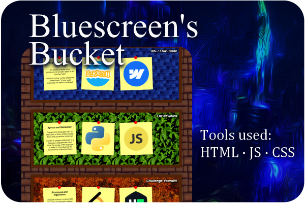

# About

Hi, I'm `@blu35creen`. Looks like you've found my GitHub.

I'm a fresh graduate on the hunt for the next fun project.

# Projects

These are the main projects I'll show off. Message me if you're about to offer me a job but want keys to the castle first.

## ScamAway

My Final-Year Project, as a monster of a collaboration with the lovely `@maegancp`, `@chloekkk`, `@ahmadmirza17` and others. (Hi!)

In order to keep Singapore's cyber-environment free of threats, our sponsor wished to be able to rapidly scan and sort websites and identify potential threats in order to refer to the relevant authorities for blocking or investigating. Our objective was to make it possible to scan 500k sites in 24 hours, a goal we brought within reach!

On top of the ability to scrape and sift through massive amount of data to identify cyber-threads, we also added utilities to enable access to the server-hosted application from multiple endpoints, GUI-based interaction through a web application, archiving and retrieval of historical run data, and a thorough report highlighting the technologies and heuristics we explored but discarded.

## MathsOps

A small, simple game, MathsOps quizzes players with rapid-fire questions relating to the four operations.

A labour of love for my dad. He's awesome.

## Bluescreen's Bucket

My current side project, Bluescreen's Bucket is a consolidation of the various tips and advice I have given over the years of peer tutoring for programming and computing courses, tricks that I've picked up both as a digital artist and designer, and lessons that I gleaned from teaching introductory programming to Primary School students.

The contents are designed to be easily understood and replicable by a novice programmer, while providing inspiration for projects that they can take on. I want to strategically encourage programmers to make use of the various techniques available to them for HTML/JS website-building, because the best way to learn is by doing, but the second best is by watching!

You can check it out (in its current half-complete state) on my Neocities at its [eventual home](https://blu35creen.neocities.org/).

<!---# More Projects
These are the projects that I've also contributed work on.
- Memories From the Plantation
- Daedalous
--->

# ...About?

You've caught me. I'm a summa cum laude graduate from SMU's BSc (Computing & Law) programme, with a second major in Information Systems - Digitalization and Cloud Solutions track.

I am also a nerd who teaches Scratch and Python and Excel and, on occasion and when pressed, Microsoft Word.

I also draw. A lot. With my iPad. That profile picture is my work.

Pleased to meet you!
